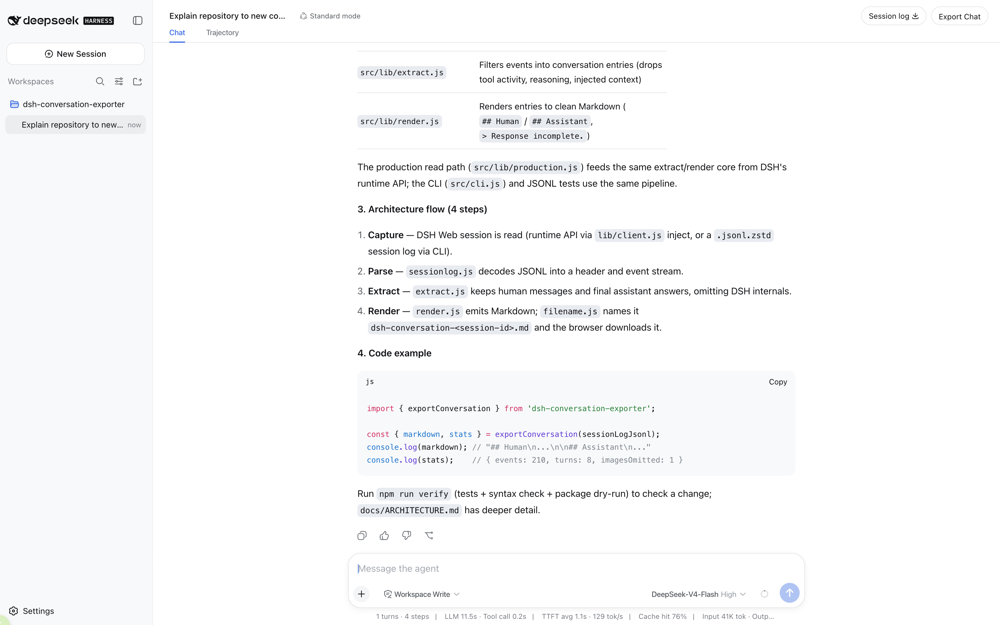
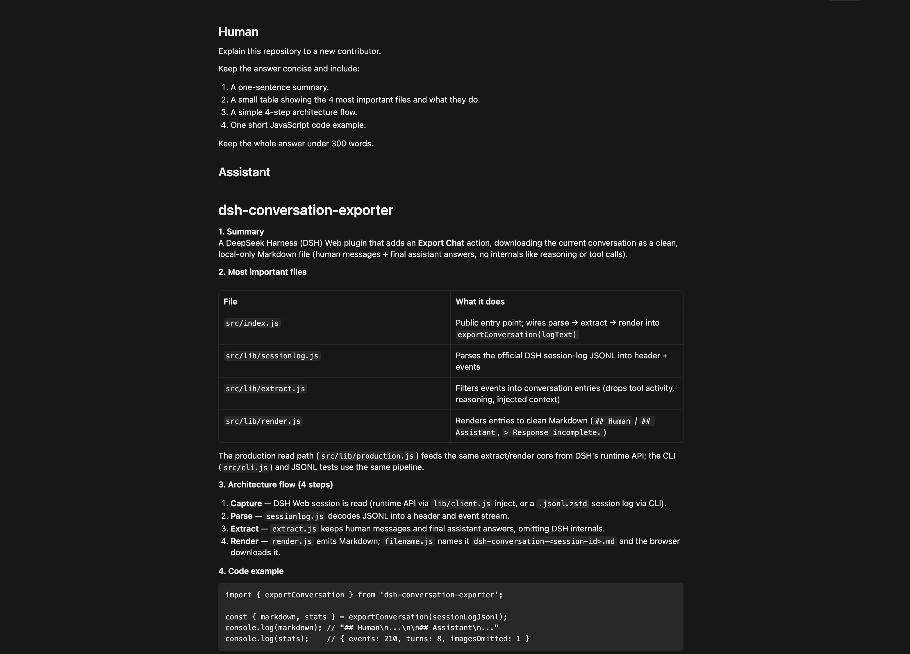
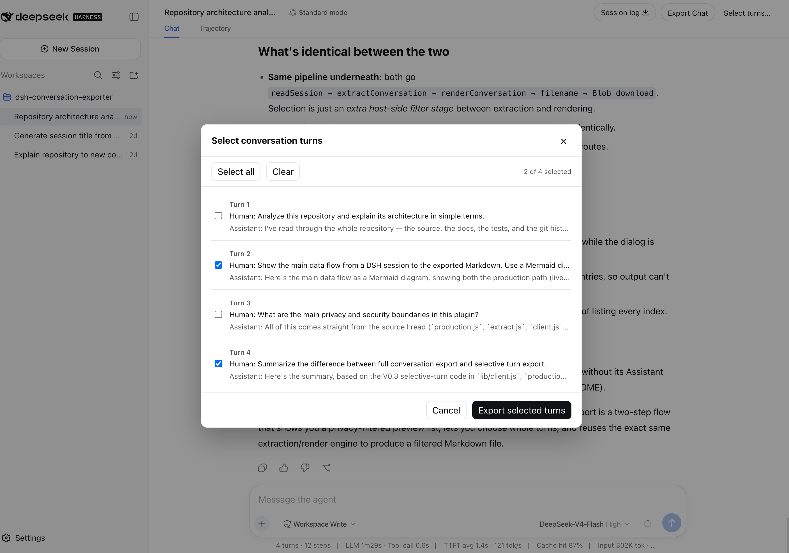
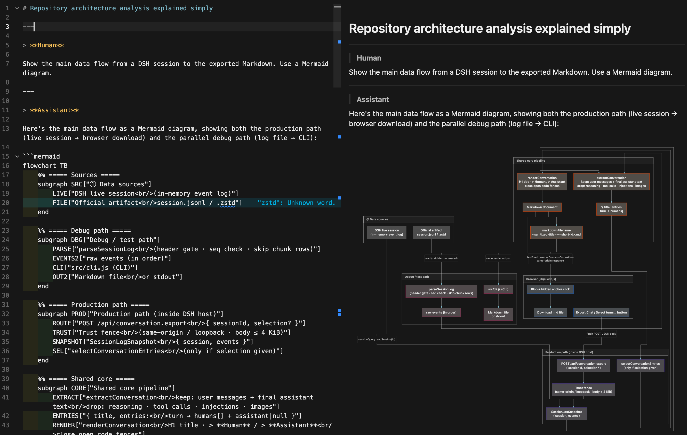
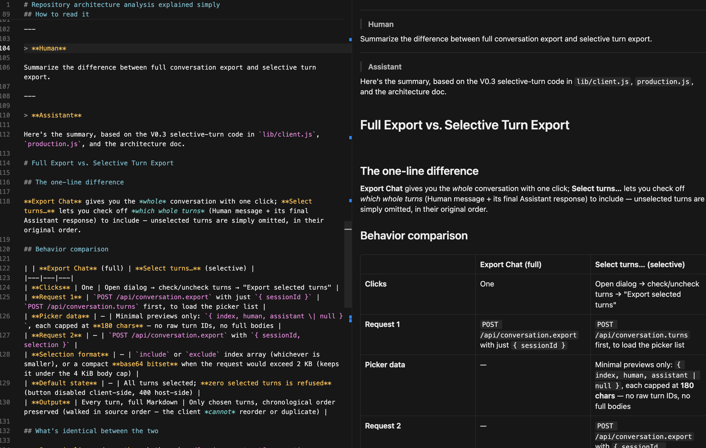

# DSH Conversation Exporter

DSH Conversation Exporter adds two local export actions to DeepSeek Harness (DSH) Web.
**Export Chat** downloads the whole current conversation as clean, readable Markdown in
one click. **Select turns…** exports a chosen subset of whole conversation turns. A turn
means the Human message or messages plus the corresponding final Assistant response;
selected turns keep their original chronological order, and unselected turns are omitted.

Listed in [Awesome DSH Plugin](https://github.com/awesome-dsh-plugin/awesome-dsh-plugin)
under **Sessions & Messages**.

## Demo

Use **Export Chat** for the full current conversation, or **Select turns…** to export
chosen whole turns only.

### Export directly from DSH Web



### Clean Markdown output



### V0.3 Selective Turn Export

Choose only the whole conversation turns you want to keep.



Selected turns preserve rich Markdown, including Mermaid diagrams.



Unselected turns are omitted while the original chronological order is preserved.



## Export Chat vs. Session Log

**Export Chat** is an additive action; it does not replace or modify DSH's official
**Session Log** export.

| | Export Chat | Official Session Log |
|---|---|---|
| Purpose | Reading and AI handoff | Debugging, recovery, and replay |
| Contents | Human messages and final assistant answers | Raw events, chunks, tool activity, metadata, and attachments |
| Format | One Markdown file | ZIP of JSONL artifacts and media |

Use **Export Chat** when you want the conversation. Use **Session Log** when you need a
lossless record of how DSH produced it.

## Install and activate

For DSH installations run through `npx @deepseek-ai/dsh`, add the plugin to the `web`
profile:

```bash
npx @deepseek-ai/dsh plugin --profile web add dsh-conversation-exporter@latest
```

Adding the package to the `web` profile activates its host and browser components. If DSH
Web is already running, stop it and restart it so the profile is recomposed:

```bash
npx @deepseek-ai/dsh web
```

## Use

1. Open a conversation in DSH Web.
2. Select **Export Chat** to download the whole current conversation immediately, or
   **Select turns…** to choose whole turns from a chronological list.
3. If using the selector, all turns start selected. Use **Select all** or **Clear** as
   needed, then choose **Export selected turns**. Export remains disabled when none are
   selected.
4. Your browser downloads `<session-title>--<short-session-id>.md`, for example
   `Project-Architecture-Guide--2002da4d.md`.

The latest readable DSH session title becomes the Markdown H1 and a safe, readable
filename stem: `<session-title>--<short-session-id>.md`. The export uses blockquoted
**Human** and **Assistant** labels and preserves message Markdown. If one message leaves a
fenced code block open, the exporter closes that fence before the next transcript
section. An unanswered turn is marked with `> Response incomplete.`, and an image-only
human message is retained as `[Image omitted]`.

## Privacy

Exporting is local-only. The plugin reads the selected DSH session through the local DSH
runtime and returns the Markdown to the same local Web application. It has no upload,
cloud storage, telemetry, or analytics path. The repository contains only hand-written,
sanitized test conversations. The selector receives only short previews derived from the
already-filtered conversation. The selector and Markdown export exclude reasoning, tool
calls and results, injected context, runtime metadata, and raw Session Log data.

## Limitations

- Exports the current session only, in Markdown only.
- Selects whole conversation turns only; Human and Assistant bubbles cannot be selected
  independently.
- Keeps human-authored text and the final assistant answer; attachments, reasoning, tool
  activity, injected context, subagent logs, and intermediate responses are omitted.
- Preserves message Markdown verbatim except for a deterministic closing fence added when
  a message otherwise ends inside a fenced code block.
- Images are not embedded; an image-only human message is represented by the
  `[Image omitted]` placeholder.

## Compatibility

DSH is developer-preview software and its plugin APIs may change. V0.3 targets
`@deepseek-ai/dsh@0.1.0-rc.6`; a later DSH version may require an exporter update.

## Development

Requires Node.js 20 or newer.

To install the plugin from a local checkout for contributor or development testing:

```bash
npx @deepseek-ai/dsh plugin --profile web add .
```

Run the project verification locally:

```bash
npm run verify
```

This runs the complete test suite, JavaScript syntax checks, and an npm package dry-run.

Licensed under the [MIT License](LICENSE).
